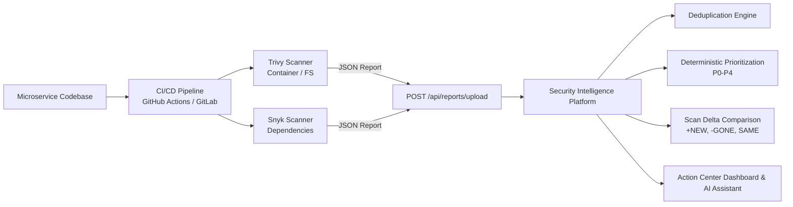

# DevSecOps CI/CD Integration Guide

This guide explains how to connect your microservices and CI/CD pipelines (GitHub Actions, GitLab CI, Azure DevOps, Jenkins) to the **Security Intelligence Platform**.

---

## 1. Architecture Overview



---

## 2. Ingesting Scans via GitHub Actions

Add the following step to your microservice's `.github/workflows/security.yml` file:

```yaml
name: Security Scan & Ingest

on:
  push:
    branches: [ main, master ]
  pull_request:
    branches: [ main ]

jobs:
  security-audit:
    runs-on: ubuntu-latest
    steps:
      - name: Checkout Code
        uses: actions/checkout@v4

      # Step 1: Run Trivy Scanner
      - name: Run Trivy Vulnerability Scanner
        uses: aquasecurity/setup-trivy@v0.2.0
        with:
          version: 'v0.48.3'

      - name: Generate Trivy Report (JSON)
        run: |
          trivy fs --format json -o trivy-report.json .

      # Step 2: Push to Security Intelligence Platform
      - name: Ingest into Security Intelligence Platform
        if: always()
        env:
          PLATFORM_URL: ${{ secrets.SECURITY_PLATFORM_URL }} # e.g. https://sec-intel.yourdomain.com or http://localhost:8080
        run: |
          curl -s -X POST "$PLATFORM_URL/api/reports/upload" \
            -F "file=@trivy-report.json" \
            -F "serviceName=payment-service" \
            -F "environment=PRODUCTION"
```

---

## 3. Ingesting Scans via Curl / CLI

Any script or pipeline can ingest reports in one line:

```bash
# Upload a Trivy or Snyk scan
curl -X POST "http://localhost:8080/api/reports/upload" \
  -F "file=@trivy-report.json" \
  -F "serviceName=auth-service" \
  -F "environment=PRODUCTION"
```

Or using our pre-built script:

```bash
# Linux / macOS / GitHub Actions
./scripts/ingest-scan.sh ./trivy-report.json payment-service PRODUCTION https://sec-intel.myorg.com

# Windows / PowerShell
./scripts/ingest-scan.ps1 -ReportFile ./trivy-report.json -ServiceName payment-service -Environment PRODUCTION
```

---

## 4. What Happens on Ingestion?

1. **Parser Detection**: Automatically detects Trivy, Snyk, SonarQube, Fortify, or 42Crunch formats.
2. **Normalization**: Maps diverse vendor payloads into a canonical `SecurityFinding` model with CVE, CVSS, affected package, version, and fix version.
3. **Cross-Tool Deduplication**: Generates deterministic fingerprints. If Trivy and Snyk report the same CVE on the same package, it is consolidated into a single finding tracking both sources.
4. **Scan Delta Comparison**:
   - `NEW`: Discovered for the first time in this scan.
   - `PRESENT`: Still vulnerable and detected in the latest scan.
   - `NOT_DETECTED_IN_LATEST_SCAN`: Vulnerability was fixed/removed in this build (Remediation Item automatically resolves!).
5. **Deterministic Risk Scoring**: Computes a 0–100 score based on CVSS + Service Business Criticality + Internet Exposure + Environment.

---

## 5. Gemini AI Integration & Intelligent Fallback

- **When `GEMINI_API_KEY` is configured**:
  The platform calls Gemini to explain root-cause risk, produce tailored code upgrade diffs, and generate daily executive security briefs.
- **When `GEMINI_API_KEY` is missing or quota is exhausted**:
  The platform **automatically and gracefully activates Deterministic Mode**. All calculations, scan comparisons, CSV exports, and priority explanations continue running locally using scanner-grounded facts.

